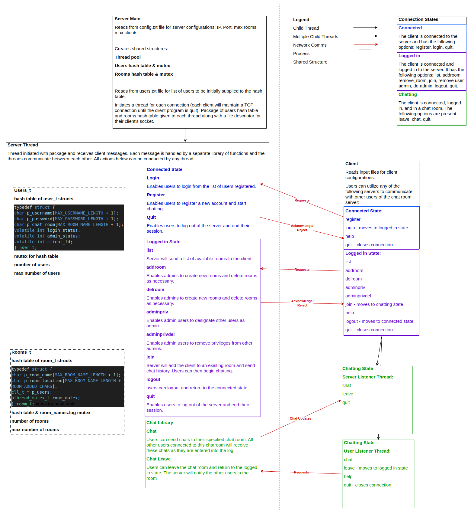
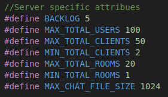
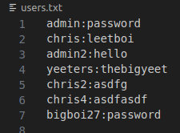
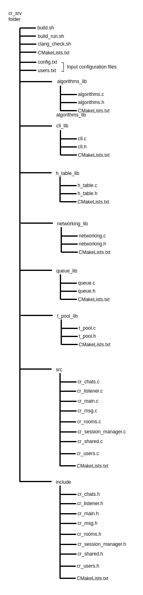

# Chat Room
### Version 1.0.0

[GIF of Chat Server Running]

# 1. Chat Room overview

A custom command line interface chat server. Demonstrates basic networking concepts in C and python. Also Demonstrates some important data structures utilizing the standard C library.

*Figure 1. Chat Room overview flowchart.*

# 2. Message protocols

The following message protocols are used for chat room communications. Most messages have opcodes request (to the server) and acknowledge/reject (to the client), but the packet type and subtype identify what communications are occuring. If the packet is of type reject, the packet will also include a reject code. Request packets of type/sub-type account-register, account-login, account-admin, account-delete, rooms-create, rooms-delete, rooms-join, and chat-chat will also contain char arrays that identify username/password/room name. The servers room-join-acknowledge and chat-chat-acknowldge will also have larger packets with 3 byte headers.

### 2.1 Packet type codes

|||
|-|-|
|Rooms|0x00|
|Account|0x01|
|Chat|0x02|
|Session|0x03|
|Failure|0xFF|

 

### 2.2 Sub-types:
|||
|-|-|
|Join|0x00|
|List|0x01|
|Create|0x02|
|Register|0x03|
|Login|0x04|
|Admin|0x05|
|Chat|0x06|
|Fail|0x07|
|Delete User|0x08|
|Admin remove|0x09|
|Leave|0x0a|
|Logout|0x0b|
|Quit|0x0c|

 

### 2.3 Opcodes:
|||
|-|-|
|Request|0x00|
|Response|0x01|
|Reject|0x02|
|Acknowledge|0x03|
|Update|0x04|

 

### 2.4 Reject codes:
||||
|-|-|-|
|Server Busy|0x00|Server is unable to take anymore clients|
|Server Error|0x01|An error has occured on the server|
|Invalid Packet|0x02|The server received an invalid packet|
|Username length|0x03|The username length is not in the range 1 to 30 characters|
|Username characters|0x04|Unrecognized characters in username|
|Password length|0x05|The password length is not in the range 1 to 30 characters|
|Password characters|0x06|Unrecognized characters in password|
|User does not exist|0x07|client attempted to alter or login to a user that doesn't exist|
|Incorrect password|0x08|Incorrect password submitted|
|Admin priviledge|0x09|User attempted a command only authorized to admins|
|User Exists|0x0a|User attempted to register a username that already exists|
|Room exists|0x0b|User attempted to create a room that already exists|
|User logged in|0x0c|User attempted to alter or login to a user that is already logged in|
|Admin self|0x0d|User attempted to delete or modify their own account|
|Max Users|0x0e|Maximum number of user accounts already exist|
|Max clients|0x0f|Maximum number of clients already connected|
|Max rooms|0x10|Maximum number of rooms already created|
|No Rooms|0x11|No rooms are available - response to list command|
|Room Length|0x12|The room name was too short|
|Room chars|0x13|Invalid characters in room name|
|Room does not exist|0x15|Room does not exist|
|Room in use|0x16|The room is currently in use and cannot be deleted|

 

# 3. User guide

For first time users of the chat room, please see guidance on client and server usage below!

### 3.1 Server:

The config text file should follow the following example exactly as the program reads the line numbers 2, 5, 8, and 11 and uses the information as long as the IP and Port numbers are valid, and max rooms and clients are within the ranges identified in cr_chared.h. Those defaults are also shown below.

*Figure 2. Configuration file example.*

*Figure 3. Server attributes set in cr_shared.h.*

Once the configuration file is set up (feel free to stick with the defaults), the executable can be run by simply using `./chat_room`

The users.txt file will not be changed between runs of the chat room server and can be changed manually. The format of user:password\n must be adhered to or the server will not run. Alternatively, sign in as the admin and accounts can be deleted as necessary (any connection can register users). The users.txt file should not be renamed either or another file will be created during run with the name users.txt and anyone could create the admin account with the correct priviledges.

*Figure 4. Users.txt example.*

The required files for compiling the chat room executable are shown in the figure below. The cr_shared.h file is included in all other chat room header files. All modular libraries (cll, queue, thread pool, hash table, and algorithms libs) are included in this shared header filer.

*Figure 5. Chat Room Server folder file structure.*

### 3.2 Client:

[Link to example video of client usage.](readme_pics/example.mp4)

### 3.3 SSL Certificate

The server must get a verified certificate to be able to be verified by clients. With the current implementation of the client, a self signed certificate will do, as the client is programmed not to check. To get the implementation to work, simply use the following commands to generate the files server.key and server.crt. For production use, a certificate should be obtained from a trusted/valid CA.

`openssl genpkey -algorithm RSA -out server.key`

 

`openssl req -new -key server.key -out server.csr`

 

`openssl x509 -req -days 365 -in server.csr -signkey server.key -out server.crt`

 

### 3.4 Line endings note:

If the files are editted via the windows environment, the line endings will render the server unable to run. This can be resolved by using dos2unix to switch the files back.

 

# 4. Further recommended improvements to Chat Room

1. The list of users present in a room should be sent to users upon joining the chat room.
2. Enable client and server functionality to sends files to each other.
3. Enable clients to send images and display images.
4. Implement functionality to limit password retries.
5. Enable two-factor authentication.

**6. Username/Password/Room name verification through ack packets**

In the current implementation of the project, if the client sends a packet that is malformed/too long for any requests with user/pass/room name, the error may be ignored as the server will just use the bytes allocated for the message. In this situation, the user could successfully register an account or add a room but they won't know the actual user/pass/room. In the case of a room, this wouldn't be a big deal as they could simply find the name with list. However, in the case of user/pass, they would have no way of knowing what user/pass was actually registered. With the current client configuration, they would be unable to send packets in this way, but it would not be hard to change that configuration.

**7. Partial send/receive functionality on messages:**

Currently, the client handles all partial sends. the server does not handle it with a partial receive. for most messages, this does not present a significant issue as most messages are 4 bytes or less coming from the server. On the client side, for receiving anything larger than 3 or 4 bytes, partial read functionality is enabled for both the list and chat update protocols. The server receives messages between 3 and 182 bytes in length and as such this could present issues, but has not during testing.

This is partially due to the fact that the client and server do not expect a standard packet length and cannot simply wait for a certain number of bytes. To properly handle this issue, a message footer or standard packing should be added to all messages to ensure proper partial send/recv handling.

**8. Thread pool utilization:**

The chat server uses a thread pool but each new client requires it's own thread. This is done instead of giving work to the threadpool. This threading utilization can cause latency issues when the number of clients is large and is non-ideal.

# 6. Developer Dependencies

See below for dependencies on the linux OS, where the server must be built.

sudo apt install valgrind

sudo apt install cmake

sudo apt-get install -y libssl-dev

sudo apt-get install -y libcunit1-dev

 

End of README.md file
