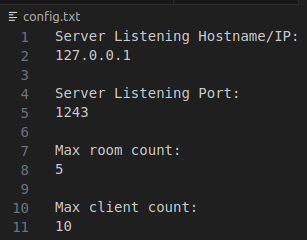

# Chat Room
### Version 1.0.0

# 1. Chat Room overview

A custom command line interface chat server. Demonstrates basic networking concepts in C and python. Also Demonstrates some important data structures utilizing the standard C library.

*Figure 1. Chat Room overview flowchart.*

# 2. Message protocols

The following message protocols are used for chat room communications. Most messages have opcodes request (to the server) and acknowledge/reject (to the client), but the packet type and subtype identify what communications are occuring. If the packet is of type reject, the packet will also include a reject code. Request packets of type/sub-type account-register, account-login, account-admin, account-delete, rooms-create, rooms-delete, rooms-join, and chat-chat will also contain char arrays that identify username/password/room name. The servers room-join-acknowledge and chat-chat-acknowldge will also have larger packets with 3 byte headers.

### 2.1 Packet type codes

|||
|-|-|
|Rooms|0x00|
|Account|0x01|
|Chat|0x02|
|Session|0x03|
|Failure|0xFF|

 

### 2.2 Sub-types:
|||
|-|-|
|Join|0x00|
|List|0x01|
|Create|0x02|
|Register|0x03|
|Login|0x04|
|Admin|0x05|
|Chat|0x06|
|Fail|0x07|
|Delete User|0x08|
|Admin remove|0x09|
|Leave|0x0a|
|Logout|0x0b|
|Quit|0x0c|

 

### 2.3 Opcodes:
|||
|-|-|
|Request|0x00|
|Response|0x01|
|Reject|0x02|
|Acknowledge|0x03|
|Update|0x04|

 

### 2.4 Reject codes:
||||
|-|-|-|
|Server Busy|0x00|Server is unable to take anymore clients|
|Server Error|0x01|An error has occured on the server|
|Invalid Packet|0x02|The server received an invalid packet|
|Username length|0x03|The username length is not in the range 1 to 30 characters|
|Username characters|0x04|Unrecognized characters in username|
|Password length|0x05|The password length is not in the range 1 to 30 characters|
|Password characters|0x06|Unrecognized characters in password|
|User does not exist|0x07|client attempted to alter or login to a user that doesn't exist|
|Incorrect password|0x08|Incorrect password submitted|
|Admin priviledge|0x09|User attempted a command only authorized to admins|
|User Exists|0x0a|User attempted to register a username that already exists|
|Room exists|0x0b|User attempted to create a room that already exists|
|User logged in|0x0c|User attempted to alter or login to a user that is already logged in|
|Admin self|0x0d|User attempted to delete or modify their own account|
|Max Users|0x0e|Maximum number of user accounts already exist|
|Max clients|0x0f|Maximum number of clients already connected|
|Max rooms|0x10|Maximum number of rooms already created|
|No Rooms|0x11|No rooms are available - response to list command|
|Room Length|0x12|The room name was too short|
|Room chars|0x13|Invalid characters in room name|
|Room does not exist|0x15|Room does not exist|
|Room in use|0x16|The room is currently in use and cannot be deleted|

 

# 3. User guide

For first time users of the chat room, please see guidance on client and server usage below!

### 3.1 Server:

The config text file should follow the following example exactly as the program reads the line numbers 2, 5, 8, and 11 and uses the information as long as the IP and Port numbers are valid, and max rooms and clients are within the ranges identified in cr_chared.h. Those defaults are also shown below.

*Figure 2. Configuration file example.*

*Figure 3. Server attributes set in cr_shared.h.*

Once the configuration file is set up (feel free to stick with the defaults), the executable can be run by simply using `./chat_room`

The users.txt file will not be changed between runs of the chat room server and can be changed manually. The format of user:password\n must be adhered to or the server will not run. Alternatively, sign in as the admin and accounts can be deleted as necessary (any connection can register users). The users.txt file should not be renamed either or another file will be created during run with the name users.txt and anyone could create the admin account with the correct priviledges.

*Figure 4. Users.txt example.*

The required files for compiling the chat room executable are shown in the figure below. The cr_shared.h file is included in all other chat room header files. All modular libraries (cll, queue, thread pool, hash table, and algorithms libs) are included in this shared header filer.

*Figure 5. Chat Room Server folder file structure.*

### 3.2 Client:

The client only has three required files - cr_client.py, _cr_messages.py, and _cr_utility.py. To run the program simply use the following command: `python3 cr_client.py -h hostname -p port_number`

The client has three states: connected, logged in, and chatting. Each state has different options, and the help screen for each are show in the figures below. Many of the options require admin priviledges so it's important to have an admin that can set up the chat rooms or give admin priviledges to other users.

*Figure 6. Connected State options.*

*Figure 7. Logged in State options.*

*Figure 8. Chatting State options.*

### 3.3 SSL Certificate

The server must get a verified certificate to be able to be verified by clients. With the current implementation of the client, a self signed certificate will do, as the client is programmed not to check. To get the implementation to work, simply use the following commands to generate the files server.key and server.crt. For production use, a certificate should be obtained from a trusted/valid CA.

`openssl genpkey -algorithm RSA -out server.key`

 

`openssl req -new -key server.key -out server.csr`

 

`openssl x509 -req -days 365 -in server.csr -signkey server.key -out server.crt`

 

### 3.4 Line endings note:

If the files are editted via the windows environment, the line endings will render the server unable to run. This can be resolved by using dos2unix to switch the files back.

# 4. Testing notes

Each of the programs (chat_room and cr_client.py) have associated cuint test and python unittest (chat_room_unit_test and test_me.py) but this does not encapsulate all the testing that was done. Due to the threading and shared structures in the client and server, many of the functions could not be easily tested independently.

Please see below for the list of test cases accounted for while running the chat room server with chat room clients:

 

### 4.1 Accounts testing:

1. Usernames and passwords of length 8
2. Username of admin (not allowed - on users.txt already)
3. Username length of less than 1
4. Username length of greater than 30
5. Password length less than 5
6. Password length greater than 30
7. Username or password with invalid characters
8. Registering username that already exists
9. Logging in with incorrect password
10. Logging in as user already logged in
11. Logging in when max number of clients is already met
12. Logging in as a user that doesn't exist
13. Giving Admin privileges to a user that's logged in
14. Giving admin privileges while not being an admin
15. Giving admin privileges to an invalid user
16. Removing admin privileges from a logged in user
17. Removing admin privileges while not being an admin
18. Removing admin privileges to an invalid user
19. Logging out
20. Removing a user that does not exist
21. Removing a user while not being an admin
22. Removing a user that's logged in
23. Removing the requesting user

 

### 4.2 Rooms testing:

1. Adding a room
2. adding a room with invalid characters
3. adding a room that already exists
4. adding a room after the maximum number of rooms has been met
5. adding a room with more than 30 characters
6. adding a room with less than 5 characters
7. adding a room without admin privileges
8. deleting a room that doesn't exist
9. deleting a room with more than 30 characters
10. deleting a room with less than 5 characters
11. deleting a room without admin privileges
12. deleting a room that is in use
13. Requesting a rooms list when there are no rooms
14. joining a room that doesn't exist
15. joining a room with other users in it
16. joining a room sends chat history
17. log files are created on server startup and deleted on shutdown
18. joining the room notifies the other users in the chat room

 

### 4.3 Chats testing:

1. leaving the chat room
2. chatting in one room with 1-4 users
3. chatting in two rooms with 1-4 users each
4. sending multiple chats before the other user refreshes the history
5. leaving the room notifies the other users in the chat room

 

### 4.4 Session testing:

1. quiting from the chat room
2. quitting from the logged in state
3. quitting from the connected state

 

NOTE: The client program does not respond well to cntrl+c (while in the chatting state) and is not intended to shut down in that manner. Users should leave the program by entering quit at any state within the program.

 

### 4.5 Linting:

Clang-tidy was run on all program files and only produced output related to functions without security checks. The list of functions mentioned as insecure are as follows: memset, memcpy, strncpy, strcpy, snprintf, and sprintf. These are all included within the JQR scope to my knowledge.

pylint was used to verify python code met the standard. The cr_state class has 11 attributes as opposed to the recommended seven but the code is much more readable this way, and as such I deviated from the standard in this instance. The deviations in test_me.py exist due to unittest being used.

*Figure 9. Pylint output.*

 

# 5. Further recommended improvements to Chat Room

1. Register chat room server and get verified certificate.
2. The client should be given a GUI or use python curses to more effectively output received chat messages.
3. The list of users present in a room should be sent to users upon joining the chat room.
4. Enable client and server functionality to sends files to each other.
5. Enable clients to send images and display images.
6. Implement functionality to limit password retries.
7. Enable two-factor authentication.

**8. Username/Password/Room name verification through ack packets**

In the current implementation of the project, if the client sends a packet that is malformed/too long for any requests with user/pass/room name, the error may be ignored as the server will just use the bytes allocated for the message. In this situation, the user could successfully register an account or add a room but they won't know the actual user/pass/room. In the case of a room, this wouldn't be a big deal as they could simply find the name with list. However, in the case of user/pass, they would have no way of knowing what user/pass was actually registered. With the current client configuration, they would be unable to send packets in this way, but it would not be hard to change that configuration.

**9. Partial send/receive functionality on messages:**

Currently, the client handles all partial sends. the server does not handle it with a partial receive. for most messages, this does not present a significant issue as most messages are 4 bytes or less coming from the server. On the client side, for receiving anything larger than 3 or 4 bytes, partial read functionality is enabled for both the list and chat update protocols. The server receives messages between 3 and 182 bytes in length and as such this could present issues, but has not during testing.

This is partially due to the fact that the client and server do not expect a standard packet length and cannot simply wait for a certain number of bytes. To properly handle this issue, a message footer or standard packing should be added to all messages to ensure proper partial send/recv handling.

**10. Thread pool utilization:**

The chat server uses a thread pool but each new client requires it's own thread. This is done instead of giving work to the threadpool. This threading utilization can cause latency issues when the number of clients is large and is non-ideal.

# 6. Developer Dependencies

See below for dependencies on the linux OS, where the server must be built.

sudo apt install valgrind

sudo apt install cmake

sudo apt-get install -y libssl-dev

sudo apt-get install -y libcunit1-dev

 

End of README.md file
